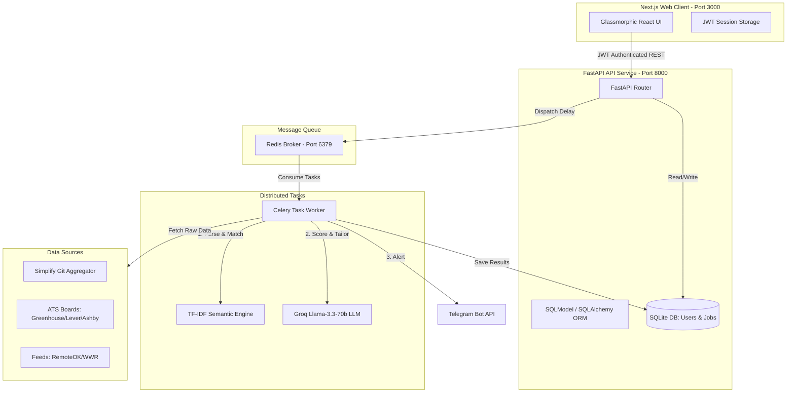

# Internship Hunter: Full-Stack AI-Powered SaaS & Distributed Crawling Agent

An autonomous, multi-user portfolio application designed to solve the internship search loop. The platform continuously monitors multiple ATS databases (Greenhouse, Lever, Ashby) and developer job aggregates, computes match scores using local **Semantic Vector Space (TF-IDF Cosine Similarity)** matching and **Llama-3.3-70b-versatile AI** analysis, generates cold outreach drafts, and triggers instant notifications via Telegram.

Built with a modern full-stack architecture featuring a Next.js frontend dashboard, a FastAPI REST server, a SQLite database, and a distributed worker queue powered by **Celery** and **Redis**.

---

## 🛠️ System Architecture

The application is structured as a multi-tier distributed system:



---

## ✨ Features

*   **🔒 SaaS Multi-User Security**: Full registration, cryptographically secure password hashing (`bcrypt`), and session-guarded access (`JWT tokens`) isolating dashboard data and configs by user ID.
*   **⚡ Dual-Engine Match Scoring**:
    *   **Semantic Vector Match**: Runs a local TF-IDF (Term Frequency-Inverse Document Frequency) bag-of-words vectorizer to compute cosine similarity between the candidate's resume and job description.
    *   **LLM Fit & Advice**: Calls Groq's high-speed inference engine using **Llama-3.3** to perform qualitative alignment analysis, generate outreach messages, and suggest tailored resume edits.
*   **🌀 Asynchronous Celery & Redis Pipeline**: Decouples API query limits and crawls from the HTTP server thread. Crawling is fully asynchronous, reliable, and scalable.
*   **📊 Premium Glassmorphic Dashboard**: A Dark-Mode React layout featuring match-score filter thresholds, interactive search panels, detail modals with outreach copy utilities, live resume editing, and an interactive loading facts strip.
*   **🐳 1-Command DevOps Setup**: Includes multi-stage Dockerfiles and `docker-compose.yml` to spin up Next.js, FastAPI, Celery, and Redis with data persistence.

---

## 🚦 Quickstart Setup

### Prerequisites
*   [Docker Desktop](https://www.docker.com/products/docker-desktop/) (running)
*   A Groq API Key (from [console.groq.com](https://console.groq.com/))
*   A Telegram Bot Token and Chat ID (for job alerts)

### Running with Docker Compose (Recommended)
1.  **Configure Environment**:
    Create a `.env` file in the root folder and fill in your keys:
    ```env
    GROQ_API_KEY=gsk_xxxxxxxxxxxxxxxx
    TELEGRAM_BOT_TOKEN=8862619223:AAH09Q37_id69uWRsvHjO-wx9s56uh3Peps
    TELEGRAM_CHAT_ID=1279324049
    ```

2.  **Launch Container Stack**:
    ```bash
    docker-compose up --build -d
    ```

3.  **Access Apps**:
    *   **Frontend Dashboard**: `http://localhost:3000`
    *   **FastAPI backend**: `http://localhost:8000`
    *   **Redis Message Broker**: `http://localhost:6379`

---

## 🎯 Dual-Scoring Engine Details

### 1. Vector Space Model (TF-IDF & Cosine Similarity)
Implemented in Python without external libraries to show foundational mathematical capabilities. Cosine similarity calculates the angle between the frequency vector of resume terms ($A$) and job description terms ($B$):

$$\text{similarity} = \frac{A \cdot B}{\|A\| \|B\|} = \frac{\sum_{i=1}^{n} A_i B_i}{\sqrt{\sum_{i=1}^{n} A_i^2} \sqrt{\sum_{i=1}^{n} B_i^2}}$$

### 2. Large Language Model (Groq Llama-3.3-70b)
Performs structured analysis returning:
*   A logical fit score (0-100) based on targeted role guidelines.
*   Match reason summary.
*   **Resume Tips**: Actionable feedback detailing what keywords to add to your bullet points to optimize against Applicant Tracking Systems (ATS).

---

## 🚀 Cloud Production Deployment Guide

### Backend & Celery Worker (Railway/Render)
1.  Provision a **Redis** instance in one click on Railway.
2.  Deploy **FastAPI**: Set start command to `uvicorn server:app --host 0.0.0.0 --port $PORT`.
3.  Deploy **Celery Worker**: Link the same repository and set start command to `celery -A celery_worker.celery_app worker --loglevel=info`.
4.  Configure Environment Variables: Inject your `GROQ_API_KEY`, `TELEGRAM_BOT_TOKEN`, `TELEGRAM_CHAT_ID`, and the hosted `REDIS_URL`.

### Frontend Web Server (Vercel)
1.  Create a project on Vercel and link your repository.
2.  Set the **Root Directory** setting to `frontend/`.
3.  Add `NEXT_PUBLIC_API_URL` environment variable pointing to your deployed FastAPI backend URL, and click **Deploy**.
